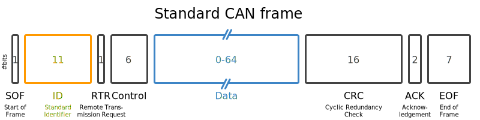

# Calculating CAN traffic

In order to calculate the CAN load, we must declare a few variables and their importance within the CAN protocol.

## Baud

The baud rate is the rate at which data is transfered in a communication channel (like CAN). For example, 9600 Baud rate is 9600 bits per second

## Frequency

The frequency of a message, expressed in (Hz), is how often a message is transmitted per second. Different messages can have different frequencies.

This variation affects the total bits transmitted and, in turn, the bus load. To calculate bits per second, consider each message’s frequency and whether their lengths differ.

## Message Length

The message length in a CAN frame can be calculated as a function of the data length. This calculation includes several fixed fields and a variable data field, which changes based on the message's data content.

*Figure: CAN Bus Frame Diagram. Source: [CSS Electronics CAN Bus Tutorial](https://www.csselectronics.com/pages/can-bus-simple-intro-tutorial#can-bus-frames)*

Each CAN frame consists of several fields with fixed bit lengths, plus a variable-length data field. Here’s the breakdown:

- **Start of Frame (SOF)**: 1 bit
- **Identifier (ID)**: 11 bits for standard frames or 29 bits for extended frames
- **Remote Transmission Request (RTR)**: 1 bit
- **Control (DLC)**: 6 bits
- **Data**: Variable length, 8 bits per byte, depending on data length \( x \)
- **CRC**: 16 bits
- **ACK**: 2 bits
- **End of Frame (EOF)**: 7 bits

**Calculation for fixed portion(\(a\))** : (\( 1 + 11 + 1 + 6 + 16 + 2 + 7 = 44\)) bits

**Variable Portion (b)**: The data field adds 8 bits for each byte of data. So, \( b = 8 \).

**Bit Stuffing**: To ensure synchronization, CAN adds around 20% bit stuffing to the frame length. Including bit stuffing, the approximate formulas are:

- **For a Standard Frame**: \( M(x) \approx 44 + 10x \) bits

### Final Formula

A message with data length of \( x \) bytes requires up to \( a + bx \) bits.

## Sample calculation

**Given**:

Baud Rate: 500 kbaud (500,000 bits transferred per second)

|Message Length| Data Length| Frequency (Hz)|
|--------------|------------|---------------|
|Battery Status|     8      |     100       |
|Motor Control|      5      |     50        |

Let \(M_1\) represent data length in bytes:

$$
\text{Total Bits Per Second} = \sum_{i=1}^n \left(\text{Frequency}_i \times \text{Message Length}_i\right)
$$

$$
\text{Total Bits Per Second} = (M_1 \times 8 \, \text{bits/byte} \times F_1) + (M_2 \times 8 \, \text{bits/byte} \times F_2)
$$

$$
\text{Total Bits Per Second} = (8 \times 8 \times 100) + (5 \times 8 \times 50) = 6400 + 2000 = 8400 \, \text{bits per second}
$$

## Calculating Bus Load

$$
\text{Bus Load}\%= \frac{\text{Total Bits per Second}}{\text{Baud Rate}} \times 100\%
$$

$$
\text{Bus Load} = \left(\frac{8400}{500,000}\right) \times 100\% = 1.7\%
$$
