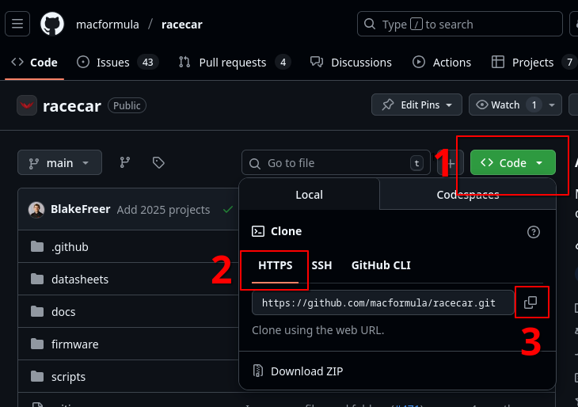

# Development Environment Setup

## Visual Studio Code

Install it from <https://code.visualstudio.com/Download>.

## Python

Install the latest Python from <https://www.python.org/downloads/>. We require version 3.13 or newer. When prompted, add Python to your PATH.

Verify its installation by running

    python --version # on windows
    python3 --version # on Linux/Mac

## PlatformIO

PlatformIO is a VS Code extension which provides cross-platform support for embedded-systems development.

Follow the PlatformIO IDE installation instructions at <https://platformio.org/platformio-ide>.

Install the "Native" platform dependencies <https://docs.platformio.org/en/latest/platforms/native.html>.

_Optional: You may also install [PlatformIO Core](https://docs.platformio.org/en/latest/core/index.html) for CLI support._

!!! note "Note on C++ Extensions"

    The PlatformIO VS Code extension will automatically install the [C/C++ extension](https://marketplace.visualstudio.com/items?itemName=ms-vscode.cpptools) to provide language support.
    
    Prior to 2025-26, Mac Formula used [Clangd](https://marketplace.visualstudio.com/items?itemName=llvm-vs-code-extensions.vscode-clangd) for C++ language support. You should disable/uninstall the Clangd extension when working on `racecar`.

## STM32CubeMX

CubeMX is a program which generates configuration code for our microcontrollers.

1. Go to [www.st.com](https://www.st.com), click on the account :material-account: icon in the top right and create an account. You will need this username and password later on.

2. Download and install STM32CubeMX version 6.15.0 from <https://www.st.com/en/development-tools/stm32cubemx.html>.

!!! warning

    You must install __exactly__ version 6.15.0 (not even 6.15.1). Using a different version than your team members will cause conflicts when opening files.

## Git & GitHub

1. Create a GitHub account <https://github.com/>. As a student, you should join GitHub Education <https://github.com/education> to get benefits like increased storage and free GitHub Actions.

2. Install Git from <https://git-scm.com/downloads>.
    
3. (Windows only) Enable symbolic links.

    1. Enable "Developer Mode" <https://learn.microsoft.com/en-us/windows/apps/get-started/enable-your-device-for-development>
    2. Run `git config --global core.symlinks true`

??? warning "Git Bash (for Windows only)"

    Git Bash is an alternative terminal shell which is installed alongside `git`. This shell emulates the Linux bash shell, allowing you to use commands like `grep`, `ls`, `rm` and many more on Windows.

    If you are on Windows, you __must__ use Git Bash as your shell when developing in `racecar/`. (i.e. not Command Prompt or Powershell).

    In VS Code, you can change your default shell by pressing ++f1++ and entering `>Terminal: Select Default Profile` and selecting Git Bash.

### Clone the `racecar` Repository

Find our repository on GitHub <https://github.com/macformula/racecar>.

Copy the repository address:



Navigate to a directory where you want to hold the `racecar` repo, then run

    git clone --recurse-submodules https://github.com/macformula/racecar.git

!!! warning "Choosing a folder"

    Good locations are short and memorable. Consider `C:\formula\` on Windows or `~/formula` on Linux/Mac.

    Do not use a directory that has spaces anywhere in its path, such as `C:\Users\My Files\Formula`. Spaces wreak havoc on automated scripts.

!!! danger "Automated Backups"

    Never put Git repo somehwere that is automatically backed-up by another program (ex. OneDrive).

    Git _is itself_ a backup system, so it will fight with OneDrive and corrupt your local repository.

## Pre-Commit

We use [pre-commit](https://pre-commit.com/) to run formatting and code checks before the code is pushed.

```bash
pip install pre-commit
```

Now go to the `racecar/` folder and run

```
pre-commit install
```

## Optional VS Code Extensions

These extensions are not required but will improve your development experience.

- Git Graph <https://marketplace.visualstudio.com/items?itemName=mhutchie.git-graph>
- GitLens <https://marketplace.visualstudio.com/items?itemName=eamodio.gitlens>

---

You should now check out [Using VS Code and Platformio](../using-vscode-pio/index.md).
