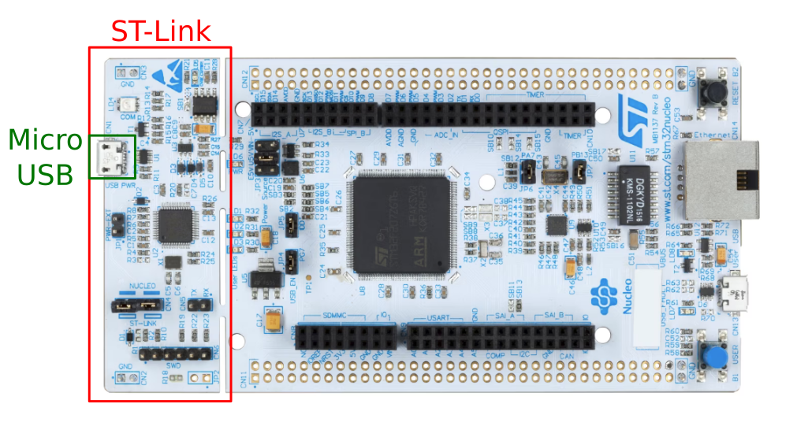
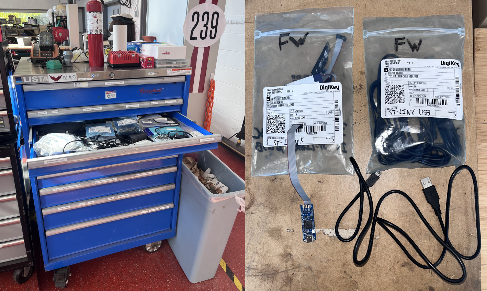
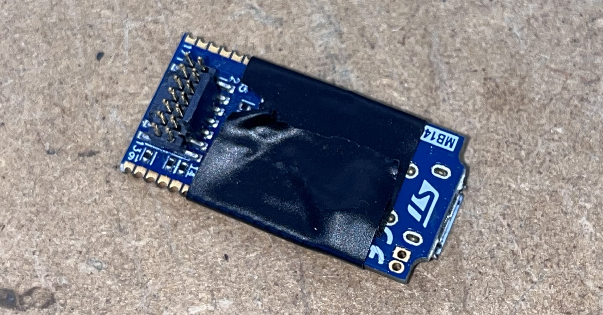
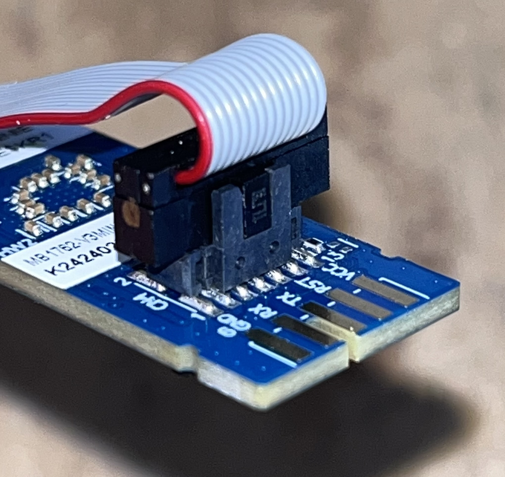
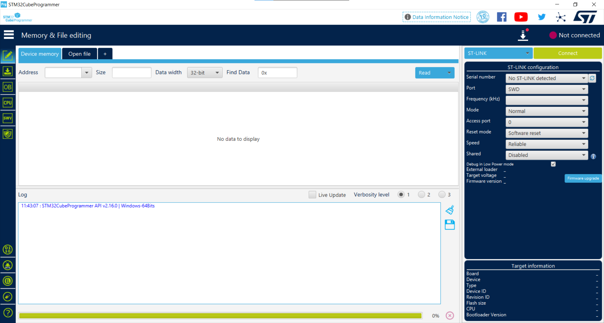
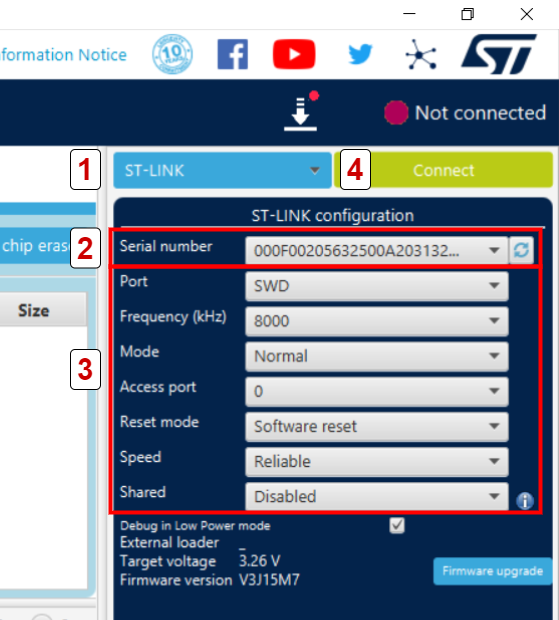
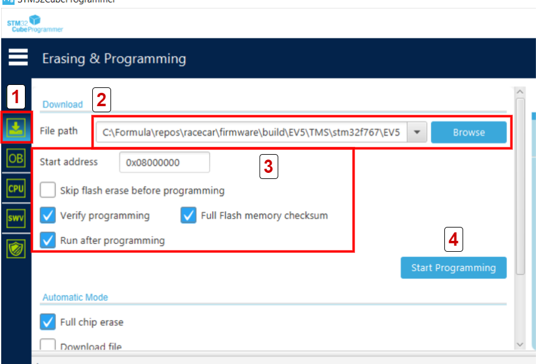

# :material-download: Flashing Firmware

After [compiling a project](/docs/firmware/compile-project.md) for the `stm32f767` platform, you need to flash the firmware to the board. This article describes how to connect to a board and flash using [STM32CubeProgrammer](/docs/firmware/dev-setup.md/#stm32cubeprogrammer).

## Connect to the Board

We flash using ST-Link which is an interface to STM microcontrollers.

### Development Boards + Dashboard

Most development boards (such as the [Nucleo-144](https://www.st.com/en/evaluation-tools/nucleo-f767zi.html) and [dashboard kit](https://www.st.com/en/evaluation-tools/stm32f7508-dk.html)) have built-in ST-Link hardware and a USB interface.

Simply connect the board to your laptop with a USB cable.

<figure markdown="span">
  { width="100%" }
  <figcaption>ST-Link on Nucleo-144 F767ZI</figcaption>
</figure>

### Vehicle ECUs

The vehicle ECUs are not development boards. They are bare STM32F7 processors soldered to a circuit board. These boards do not have a built-in ST-Link or USB interface so we must use a different connector.

You will need and external ST-Link and a USB cable from the blue tool chest in the Hatch bay. Some of the ST-Links are Micro-USB and others are USB-C. We should have cables for both.

<figure markdown="span">
{ width="80%" }
<figcaption>ST-Link and cables are kept in bags in this drawer. Return them when finished!</figcaption>
</figure>

Please wrap the ST-Link in electrical tape since it has exposed conductors and is very easy to fry.

<figure markdown="span">
{ width="80%" }
<figcaption>E-Tape would have prevented the Great ST-Link Massacre of Comp '24.</figcaption>
</figure>

1. Ensure the ECU is off (not receiving power) and the USB is not connected to your laptop.
2. Carefully connect the grey ribbon cable to the ST-Link and the JTAG connector on the ECU board.

    Both ends of the ribbon cable have a tab which must align with the notch on the connector.

    <figure markdown="span">
    { width="80%" }
    <figcaption>Connector tab and notch</figcaption>
    </figure>

3. Power on the ECU. Talk to an upper year SW or Electrical member for help.
4. Connect your laptop to the ST-Link using the USB cable.

## Open CubeProgrammer

You installed Cube Programmer when [Setting up your Development Environment](/docs/firmware/dev-setup.md). Run the program. It will open to a screen like this:

<figure markdown="span">
{ width="100%" }
</figure>

### Connect to the STM32 with ST Link

<figure markdown="span">
{ width="60%" }
</figure>

1. Select __ST-LINK__ as the programming interface.
2. Select the ST-Link device serial number. There should only be one option if you are plugged into a single device.
3. Verify the ST-Link configuration.
4. Click __Connect__.

### Flash your program

<figure markdown="span">
{ width="80%" }
</figure>

1. Switch to the __Download__ window.
2. Select the binary file to flash. This is the `.bin` file located in

    ```text
    racecar/firmware/build/PROJECT/PLATFORM/
    ```

3. Verify the flash configuration.
4. Click __Start Programming__.

## Troubleshooting

### First flash succeeds, second fails

Disconnect from the ST-Link then reconnect. Wait a few seconds and click __Start Programming__ again.

### Cannot flash at all

You are connected to ST-Link but unable to flash.

* Is the ECU powered? The ST-Link is powered by your laptop but the ECU needs external power.

### Cannot connect to ST-Link

The ST-Link serial appears but I cannot connect:

1. Verify the ST-Link configuration.

The ST-Link serial number does NOT appear:

1. Check your USB connections.
2. Verify the ST-Link is receiving power by looking for LED lights.
