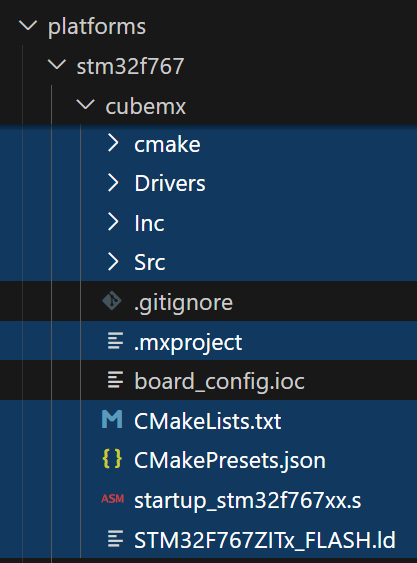

# Binding CubeMX Peripherals to Firmware

!!! danger "Prerequisite Reading"

    This article assumes you are familiar with the [`racecar/` Architecture](../architecture/index.md).

    It uses the peripheral configuration from the [previous article](configure.md).

Open your `board_config.ioc` file in CubeMX and click "Generate Code." This will surround `board_config.ioc` with autogenerated files and folders containing C code which initializes the microcontroller using the graphical CubeMX configuration.

{width=40%}

We must lift the generated C functions and variables into C++ and "bind" them to our firmware.

Start by creating a new file `platforms/stm32f767/bindings.cc`.

```c++ title="platforms/stm32f767/bindings.cc"
--8<-- "img/bindings/bindings.cc:4:"
```

??? question "Where is `bindings.hpp`?"

    We created `bindings.hpp` in the [project structure article](../project-structure/index.md), but you will need to recreate it for each project.

    Use the following `bindings.hpp` to continue the LV Controller example from the [MCU Configuration article](configure.md). Place it in the project folder (adjacent to `main.cc`, NOT in any platform folder).


    ```c++ title="bindings.hpp"
    --8<-- "img/bindings/bindings.hpp"
    ```

## Initialization

CubeMX generates *functions* to initialize the MCU according to our configuration, but we are responsible for calling them at the start of our program.

The app-level cannot call these functions since it must be platform-independent. To get around this, we let each platform define a `void Initialize()` function to call its startup code. So far, our `Initialize()` sets up the HAL and clock, but each peripheral will add to it.

## Peripherals

A C++ peripheral is created by wrapping the generated variables in an MCAL peripheral class.

For each *hardware* peripheral that you use (ex GPIO, ADC1, CAN2):

1. Include `<periph>.h` (generated by CubeMX) to access the initialization functions.
2. Call `MX_<PERIPH>_INIT()` in `Initialize()`.
3. Include the `mcal/stm32f/periph/<periph>.hpp` to access the `racecar/` peripheral class.

Then for each peripheral *instance* of that type (ex `TSSI_RED_EN` and `TSSI_GN_EN` GPIOs):

1. Define C++ peripheral in the `mcal::` namespace using the constants and handles generated by CubeMX.
2. Bind the `mcal::` object to the `shared::` handle inside the `bindings` namespace.

### Digital Input/Output (GPIO)

Construct an stm32 `DigitalOutput` or `DigitalInput` with the `<NAME>_GPIO_Port` and `<NAME>_Pin` constants defined in CubeMX's `main.h`.

> CubeMX generates these constants based on the pin configurations. For example, `TSSI_RED_EN` is connected to PC2, thus CubeMX generates
>
> ```c++ title="cubemx/inc/main.h"
> #define TSSI_RED_SIG_GPIO_Port GPIOC
> #define TSSI_RED_SIG_Pin GPIO_PIN_2
> ```

```c++ hl_lines="2 14 21-22 29-30 38" title="bindings.cc"
--8<-- "img/bindings/bindings_done.cc:4:4,7:18,21:30,37:44,51:57,60:"
```

### Analog Input (ADC)

Unlike with GPIO pins, CubeMX does not include the ADC name in the generated handles. You must manually align the ADC peripheral number (ADC1, ADC2, or ADC3) and channel for each peripheral.

For example, `DCDC_SNS` was connected to `ADC1_IN10`, so we must pass the *pointer* to the ADC1 handle `&hadc1` along with the channel 10 constant.

Note that each ADC# has its own `MX_ADC#_Init()` function.

```c++ hl_lines="2 15 26-28 38-40 49" title="bindings.cc"
--8<-- "img/bindings/bindings_done.cc:4:5,7:19,21:34,37:48,51:58,60:"
```

### CAN

Connect the CAN handle to the peripheral.

As with ADC, each CAN# has its own `MX_CAN#_Init()` function.

```c++ hl_lines="3 17 32 46 56" title="bindings.cc"
--8<-- "img/bindings/bindings_done.cc:4:"
```
