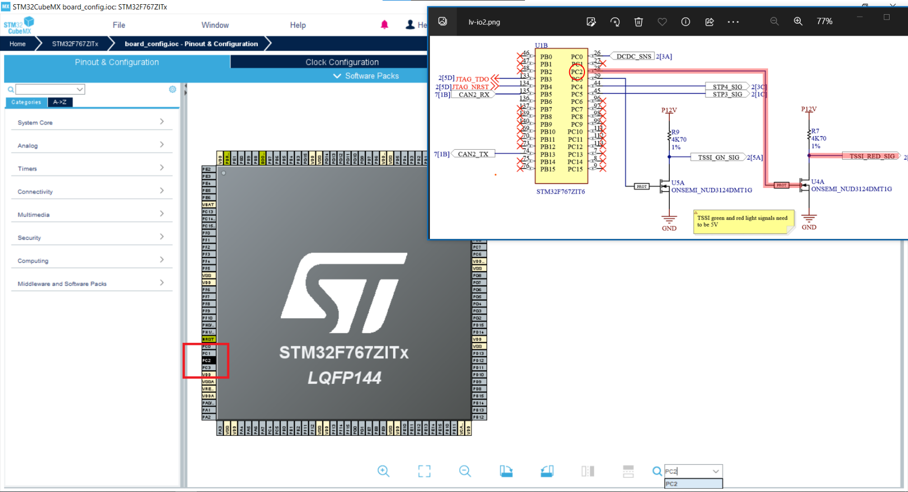
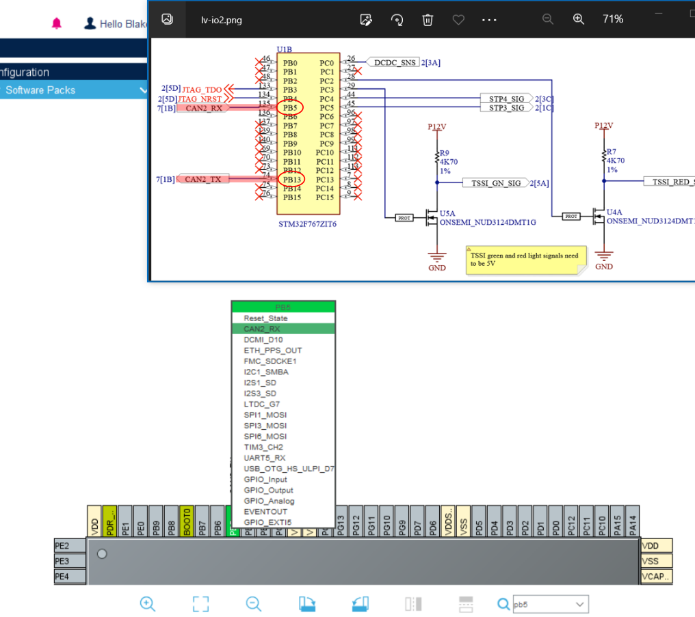
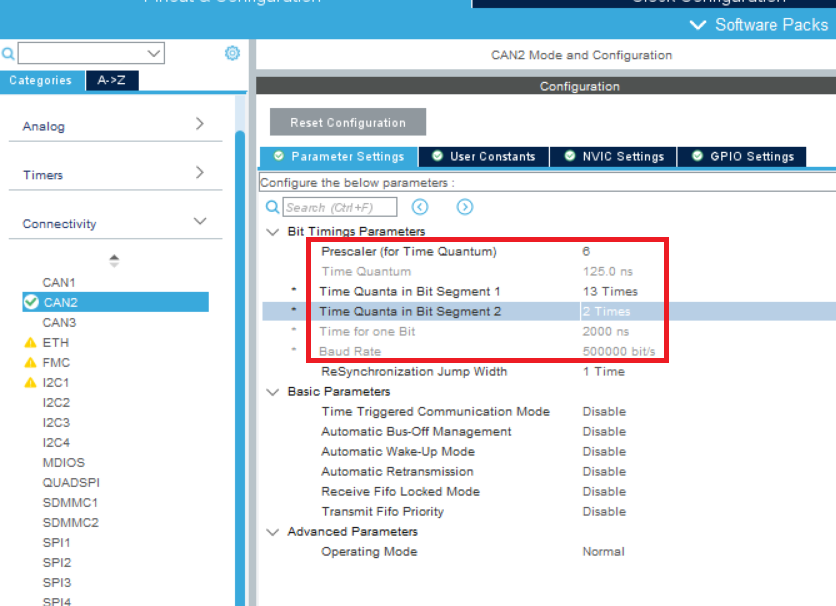

# Configure a Microcontroller in CubeMX

A microcontroller needs to interact with sensors, outputs, and communication interfaces. CubeMX helps us configure and visualize these peripherals.

In this tutorial, we will configure digital outputs, analog inputs, CAN, and JTAG on an stm32f767 microcontroller.

!!! note

    This article assumes that you have a CubeMX project from the [previous tutorial](start-cubemx-project.md).

## Electrical Schematic and Pinout

Our microcontrollers are soldered to a PCB with fixed electrical connections to the peripherals, so you should have the relevant electrical schematic handy (talk to the electrical subteam to get this).

We will configure part of the LV Controller circuit. The big yellow block is _part_ of the microcontroller and every pin that doesn't have an :x: needs to be handled.

## Pin Configuration

Open the `board_config.ioc` file in CubeMX. Go to the "Pinout & Configuration" tab. This is where you spend most of your time.

### Digital Outputs

The `TSSI_GN_SIG` and `TSSI_RED_SIG` are digital outputs which control the green and red lights of the TSSI.

The red signal is controlled by a digital output on pin PC2. Use the lower-right search field to find the pin.

Click on the PC2 label and select `GPIO Output`.

PC2 is now a GPIO output, but we should give it a descriptive name. Expand the `System Core` menu on the left and click `GPIO`. Select the PC2 pin and enter `TSSI_RED_SIG` in the user label. You can usually leave the other configuration settings at their default.

Now repeat this process for the `TSSI_GN_SIG`! Check the schematic for its pin number (PC3) and give it a label.

### Analog Inputs (ADC)

Many sensors produce a voltage related to the measured value. We need to configure a pin to read this analog voltage before firmware can calculate the measured value.

`DCDC_SNS` measures the electrical current from the high voltage battery to the low voltage circuit. Let's create an ADC input to read this value so that firmware can ensure enough power is being supplied.

Search for PC0 and set it to `ADC1_IN10`

> See Section 15 of `racecar/datasheets/stm/RM0410` for an explanation of the STM Analog to Digital converters and their channels.

To name the pin, go to `Analog -> ADC1 -> GPIO Settings`, click on PC0, and enter a label.

> In the future, you may need to modify the ADC "Parameter Settings" but we will ignore that for now.

The `DCDC_SNS` input is ready to ready voltages!

The LV Controller schematic also has two sensors `STP3_SIG` and `STP4_SIG` to measure suspension travel position. The output voltage is proportional to how compressed the suspension is. Repeat this process for those two inputs using the `ADC1` channels.

### CAN

All the vehicle ECUs communicate over the CAN bus. We must configure both the receive (RX) and transmit (TX) pins.

> A CAN bus has 2 wires: CAN High and CAN Low, but these signals do not connect directly to the microcontroller. Instead, the MCU has CAN RX and CAN TX which connect to a CAN transceiver that interfaces with the bus wires.

STM32F767 supports 3 CAN buses. LV Controller connects using the CAN2 peripheral. Search for PC5 and set its state to `CAN2_RX`.

CubeMX recognizes that RX and TX come in pairs and automatically sets PB13 to `CAN2_TX`.

!!! info "Clock Config"

    All devices on a CAN bus must agree on the same "baud rate" i.e. transmission frequency. Our vehicle uses 500 kbit/s. We must speed up the internal MCU clock to support this.

    Switch to the "Clock Configuration" tab. Change the clock source in `System Clock Mux` to PLLCLK and `APB1 Prescaler` to /2.

    

Back in the "Pinout & Configuration" tab, open "Connectivity → CAN2 → Parameter Settings." Under "Bit Timings Parameters", set

- Prescaler (for Time Quantum) = `6`
- Time Quanta in Bit Segment 1 = `13 Times`
- Time Quanta in Bit Segment 2 = `2 Times`

Verify that the calculated baud rate is 500 000 bit/s.

### JTAG Connector

The only remaining pins are the JTAG connector pins which enable programming and debugging.

Set PB4 to `SYS_JTRST`. This should automatically configure 4 other pins, including PB3 to `SYS_JTDO-SWO`.

> Pins PA13, PA14 and PA15 are not shown in this part of the schematic. CubeMX's automatic configuration for them is correct.

We do not need to further configure or rename the JTAG pins, we only need to tell the MCU that they exist.

## Conclusion

We are now done configuring the pins in this schematic! We will now bind the generated C code to our firmware in the [final tutorial](bindings.md).

