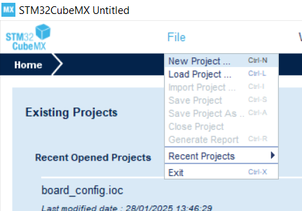
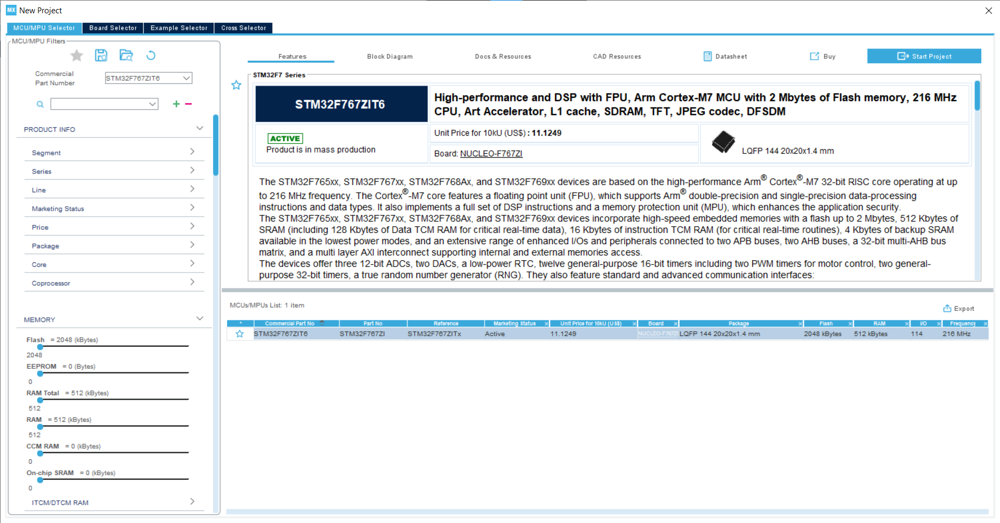
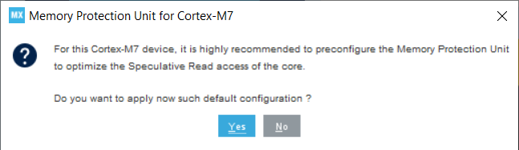
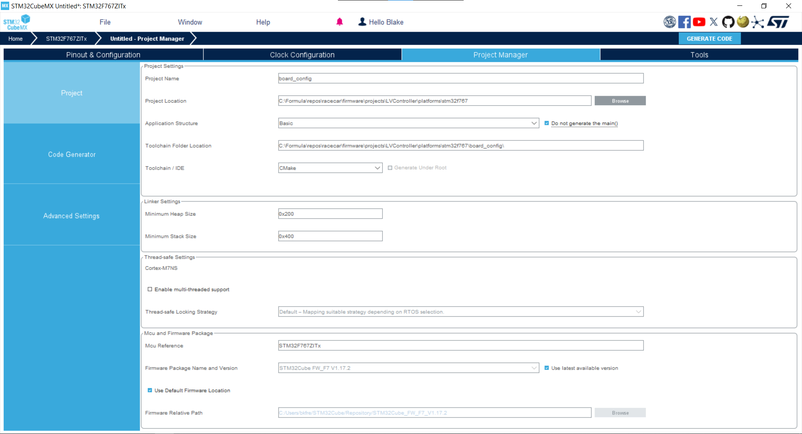

---
hide:
    - toc
---

# Start a CubeMX Project

STM32CubeMX is a graphical software which generates code to configure an STM32 Microcontroller.

The project must be configured correctly to fit our build system.

1. Open CubeMX and start a new project.

    

2. In the "MCU/MPU Selector" tab, search for the microcontroller. Most of MAC FSAE boards are `STM32F767ZIT6`. Select the board and click "Start Project."

    

3. When prompted about Memory Protection, select "Yes."

    

    !!! warning "Do not save!"

        CubeMX will now create your new project but __do not save it yet!__ Some settings cannot be changed after the first save.

4. Go to the "Project Manager → Project" tab and configure the "Project Settings":
    - Project Name = `board_config`
    - Project Location = Browse and select `racecar/firmware/projects/<PROJECT>/platforms/stm32f767`

        > Replace `<PROJECT>` with your project folder created in [this tutorial](../project-structure/index.md).

    - Application Structure = `Basic`
    - Check `Do not generate main()`
    - Toolchain Folder Location = leave as is.
    - Toolchain / IDE = `CMake`

    

    You can ignore the Linker, Thread-safe, and Package settings sections.

5. Configure "Project Manager → Code Generator → Generated files"
    - Check `Generate peripheral initialization as a pair of '.c/.h' files`
    - Check `Delete previously generated files`
    - Uncheck `Backup previously generate files`
    - Uncheck `Keep User Code`

    !!! info

        CubeMX generates C files which you can add code to, but our [Architecture](../architecture/index.md) works at a higher level. Therefore, we do not support adding code to the generated files. Unchecking these settings enforces this rule since user code will be removed.

    !!! success "Save Now"

        You can now save the project. Click "File → Save Project" or ++ctrl+s++.

6. Close CubeMX and open the Project Location we set earlier. You should see `platforms/stm32f767/board_config/board_config.ioc`. Rename the `board_config/` folder to `cubemx/` but do not rename the `board_config.ioc` file.

    ??? info "Why do we do this?"

        We shouldn't need to. The CMake build system is hardcoded to look for a `board_config.ioc` file in a `cubemx/` folder.
        
        If you want to write a better CMake function which takes the folder/filename as parameters, please be my guest. (Don't forget to update these docs afterwards!)

7. Create a `.gitignore` file to ignore all generated files in the `cubemx/` folder. We only track the `.ioc` configuration file and let CubeMX regenerate the code files locally.

    ```txt title="stm32f767/cubemx/.gitignore"
    # Do not track any files generated by STM32CubeMX.
    *
    !.gitignore
    !.board_config.ioc
    ```

---

Your CubeMX project is now ready to be compiled within `racecar/`! But the microcontroller hasn't been configured to do anything yet. Let's change that in the next tutorial.
