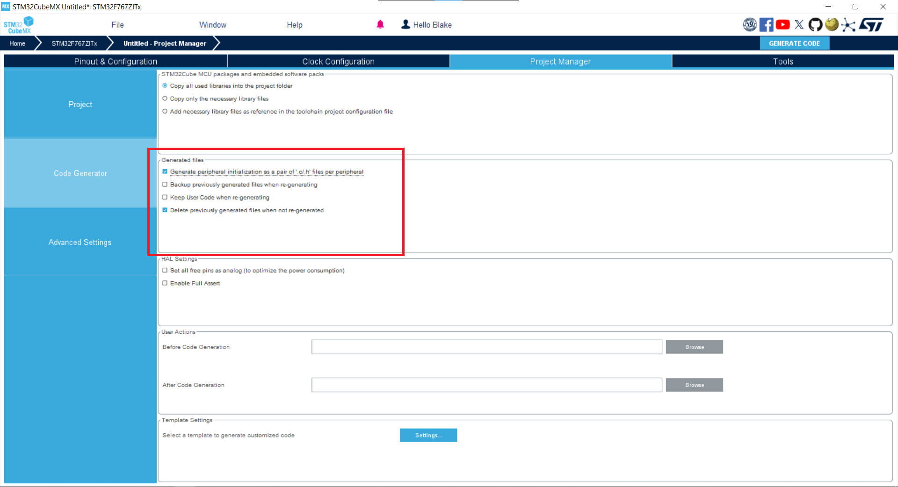

# Start a CubeMX Project

STM32CubeMX is a graphical software which generates code to configure an STM32 Microcontroller.

The project must be configured correctly to fit our build system.

!!! tip
    Click on an image to enlarge it.

## Create a new project

Open CubeMX and start a new project.


In the "MCU/MPU Selector" tab, search for the microcontroller. Most of MAC FSAE boards are `STM32F767ZIT6`. Select the board and click "Start Project."

!!! info

    If you are using a "discovery board" like a [Nucleo](https://www.st.com/en/evaluation-tools/nucleo-f767zi.html) or the dashboard's [STM32F469-DISCO](https://www.st.com/en/evaluation-tools/32f469idiscovery.html), search for the board under "Board Selector" as this will configure many of the IO for the board's hardware.


When prompted about Memory Protection, select "Yes." If asked, initialize all peripherals in their default mode.


!!! warning "Do not save!"

    CubeMX will now create your new project but __do not save it yet!__ Some settings cannot be changed after the first save.

## Configure project settings

Go to the "Project Manager → Project" tab and configure the "Project Settings":

- Project Name = `board_config`
- Project Location = Browse and select `racecar/firmware/projects/<PROJECT>/platforms/stm32f767`

    > Replace `<PROJECT>` with your project folder created in [this tutorial](../project-structure/index.md).
    >
    > `stm32f767` can be changed as appropriate.

- Application Structure = `Basic`
- Check `Do not generate main()`
- Toolchain Folder Location = leave as is.
- Toolchain / IDE = `CMake`


You can ignore the Linker, Thread-safe, and Package settings sections.

Configure "Project Manager → Code Generator → Generated files"

- Check `Generate peripheral initialization as a pair of '.c/.h' files`
- Uncheck `Backup previously generate files`
- Uncheck `Keep User Code`
- Check `Delete previously generated files`

    !!! info

        CubeMX generates C files which you can add code to, but our [Architecture](../architecture/index.md) works at a higher level. Therefore, we do not support adding code to the generated files. Unchecking these settings enforces this rule since user code will be removed.



!!! success "Save Now"

    You can now save the project. Click "File → Save Project" or ++ctrl+s++.

## Build system integration

Close CubeMX and open the Project Location we set earlier. You should see `platforms/stm32f767/board_config/board_config.ioc`. Rename the `board_config/` folder to `cubemx/` but do not rename the `board_config.ioc` file.

??? info "Why do we do this?"

    We shouldn't need to. The CMake build system is hardcoded to look for a `board_config.ioc` file in a `cubemx/` folder.
    
    If you want to write a better CMake function which takes the folder/filename as parameters, please be my guest. (Don't forget to update these docs afterwards!)

Create a `.gitignore` file to ignore all generated files in the `cubemx/` folder. We only track the `.ioc` configuration file and let CubeMX regenerate the code files locally.

```txt title="platforms/stm32f767/cubemx/.gitignore"
# Do not track any files generated by STM32CubeMX.
*
!.gitignore
!*.ioc
```

Create an `mcal_conf.cmake` file for the platform to inform the build system of how to generate the CubeMX code at build time.

```cmake title="platforms/stm32f767/mcal_conf.cmake"
set(MCAL stm32f767)
include(${CMAKE_SOURCE_DIR}/cmake/build_cubemx.cmake)
```

> The `set(MCAL ...)` command is required in any platform's `mcal_conf`.
>
> The second line is unique to `stm32` platforms, providing CubeMX generation and the `arm-none-eabi` toolchain.

Finally, create a CMakeLists with commands to link the CubeMX code to our `main` executable.

```cmake title="platforms/stm32f767/CMakeLists.txt"
target_sources(main PRIVATE bindings.cc)
target_link_libraries(main PRIVATE mcal-stm32f767)

add_subdirectory(cubemx/cmake/stm32cubemx)
target_link_libraries(main PRIVATE stm32cubemx)
```

!!! note

    `bindings.cc` doesn't exist yet, see the next tutorial.

---

Your CubeMX project is now ready to be compiled within `racecar/`! But the microcontroller hasn't been configured to do anything yet. Let's change that in the [next tutorial](configure.md).
