# Using VS Code and PlatformIO

## Openning a Project

Open a new VS Code window. Go to the Platform IO homepage by clicking the :material-home: icon in the Status Bar.

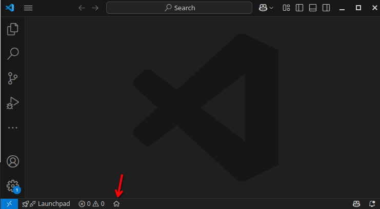

??? tip "I don't see the :material-home:"

    You can alternatively open the PlatformIO homepage running the Command Palette with ++f1++ then typing `PlatformIO: PlatformIO Home`.

From PlatformIO Home, click **Open Project** and open `racecar/projects/demo/blink`.

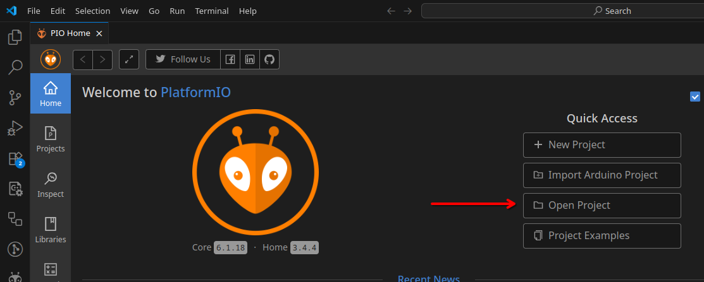

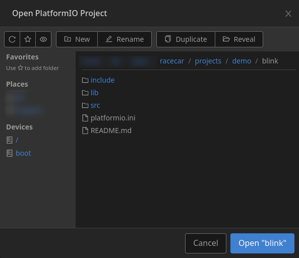

You should now see the files and folders in for the `blink` project.

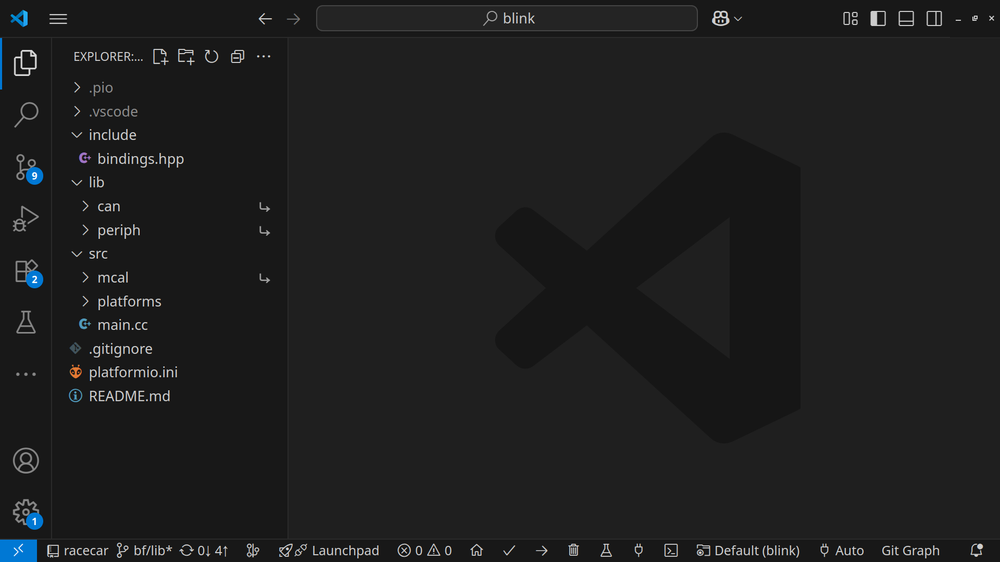

## Project Structure

Every project uses the same structure, so let's explore the itema in the `demo/blink` project. Click on a file to open it in the VS Code window.

=== "platformio.ini"

    This file describes how to compile the project.

    ```ini
    [platformio]
    name = "Blink"
    description = "A simple program to toggle a digital output."

    [env]
    ... # omitted for simplicity

    [common]
    ...

    [env:stm32f767]
    ...

    [env:stm32f469]
    ...

    [env:cli]
    ...

    [env:linux]
    ...
    ```

    PlatformIO uses __environments__ to let you define different compilation instructions for different platforms.

    This file shows that the Blink project is defined for 4 environments: STM32F767, STM32F469, a generic Command Line Interface, and the Linux CLI.

    ??? question "What is the difference between the Linux and Generic CLI environments?"

        Linux computers have certain features that aren't available on Windows and Mac, namely it supports CAN at the kernel layer (see <https://netmodule-linux.readthedocs.io/en/latest/howto/can.html>).

        This means that projects using CAN are better simulated on a Linux machine. The Blink project doesn't use CAN, so there is no difference.

=== "README.md"

    Whenever you see a README file, __read it__! It provides useful information about the code around it.

    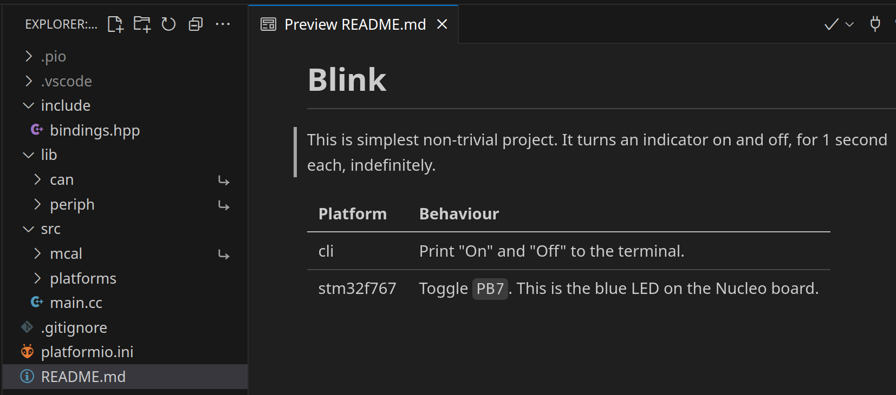

=== "src/"

    This folder contains the project "source code" (hence "src"), which is C and C++ code that tells the processor _what to do_.

    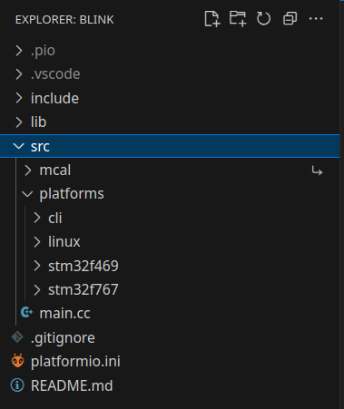

    Every project has a `main.cc` file with a `main()` function. This is where the program starts. Other projects may have more `.cc` files.

    The `src/` folder also has a `platforms/` folder, with one subfolder per environment. This subfolder connects the abstract `main` code to a specific environment platform.
    
    Finally, there is a symlink to `racecar/lib/mcal`. MCAL stands for "Micro-Controller Abstraction Layer," more on that in [Architecture](../architecture/index.md).

    ??? question "What is a symlink?"

        A symlink (symbolic link) is a "link" to another file or folder. It lets you easily reference far-away files.
        
        In our case, we write the `mcal` code once, in `racecar/lib/mcal`, but want all projects to use it. A symlink lets each project reference the same `mcal`.

=== "include/"

    These are C++ header files which don't contain source code themselves, but are "included" by other source files in `src/`

    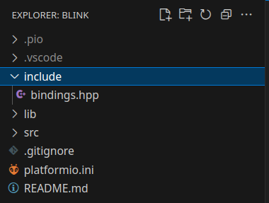

=== "lib/"

    Library code is code which we write _once_ for use in _many_ projects. Each project's `lib/` folder contains symlinks to folders `racecar/lib` depending on which shared code it needs to use.

    For example, if you want to use a Lookup Table in a project, you would add a symlink to `racecar/lib/lookup_table`.

    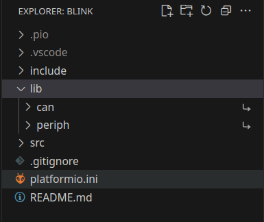

=== ".pio and .vscode"

    These are "hidden" folders managed by PlatformIO. You should not edit them.

---

## Building and Uploading with PlatformIO

First, select which environment / platform you'd like to compile for. Since the Blink project supports CLI, we will be able to run it in our terminal, so let's select the `cli` environment.

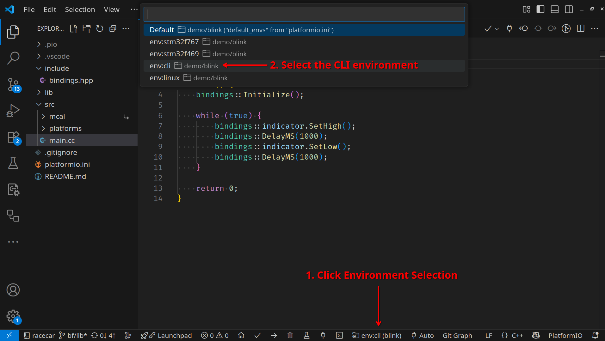

PlatformIO will quickly reconfigure itself for the new environment.

Click the Build button :material-check: to build / compile the project. PlatformIO will open a window and display progress and any errors.

> The first build may be slow since PlatformIO needs to install dependencies for each project and environment. Successive builds will be much faster.

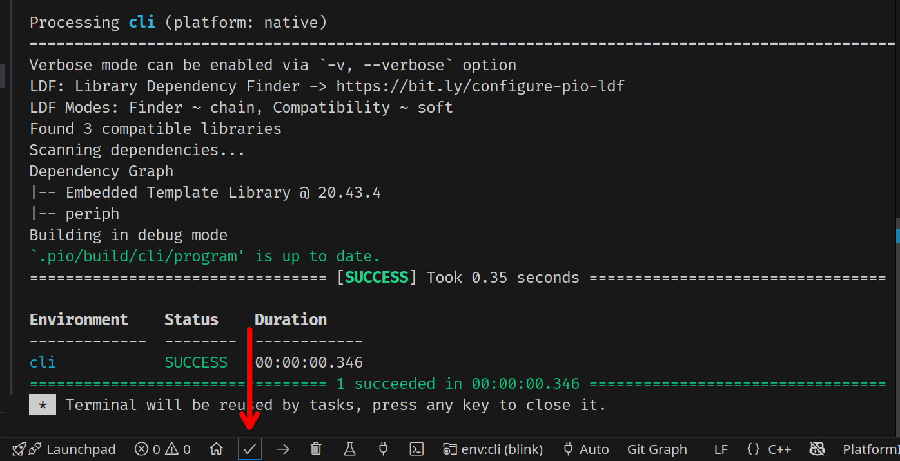

Click the Upload button :material-arrow-right: to run the Blink program in your CLI.

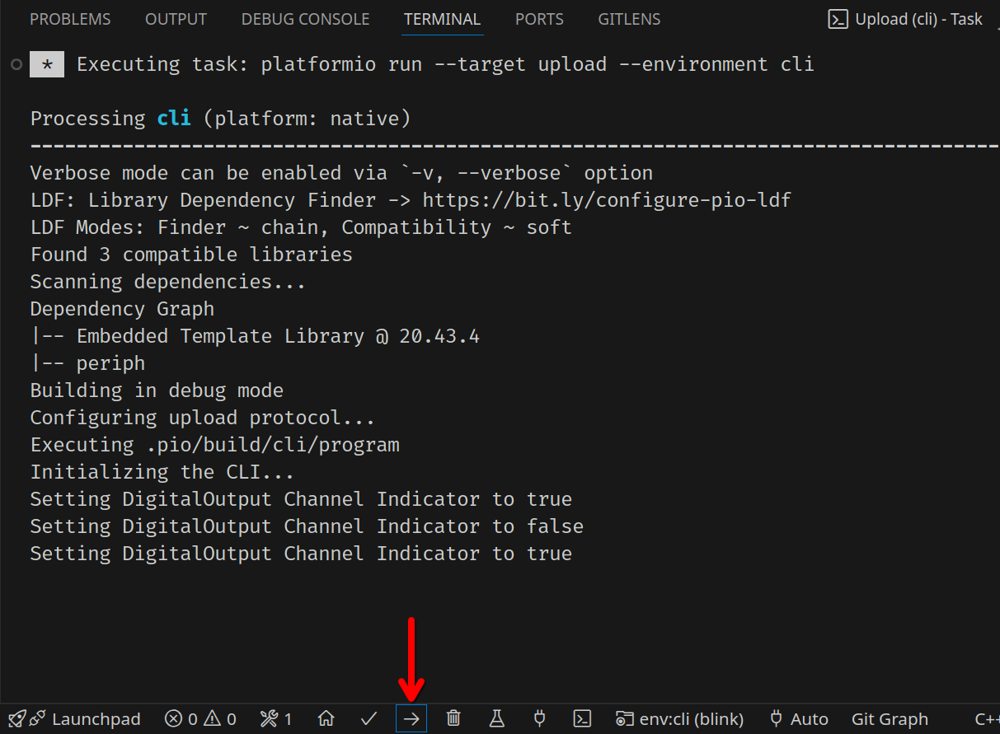

---

To upload to STM, see [Uploading Firmware to STM](../flashing/index.md).