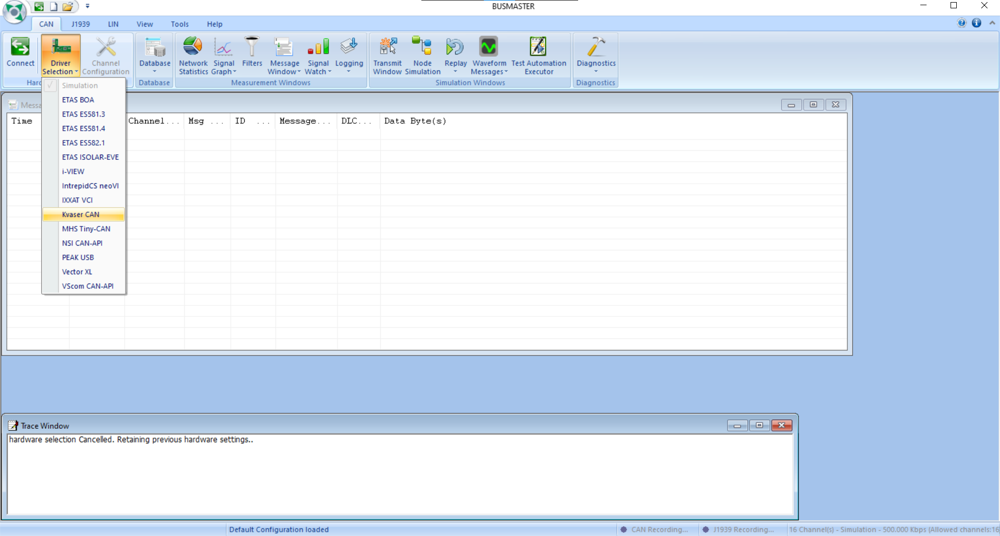

# :material-serial-port: Monitor CAN Bus with Busmaster

## You will need

- Busmaster software v3.2.2.

    > Install from <https://rbei-etas.github.io/busmaster/>

- The Kvaser USB CAN adaptor (which should be kept in the bay).

    

## Physical Connections


1. Connect the USB port the Kvaser to your computer.
2. Connect the D-Sub port of the Kvaser to the CAN port.

    === "Vehicle CAN Ports"

        Located on the underside of the dashboard. One port for the `VEH` CAN bus and one for `POWERTRAIN`.

        
        

    === "Testbench CAN Port"

        Only the `VEH` CAN bus is available.

        

## Busmaster Setup

Open Busmaster. Under "Driver Selection" choose "Kvaser CAN."



Under "Channel Configuration," configure a Kvaser channel by selecting it on the left and clicking the `>>` button. Configure the BaudRate to 500 000 bps.


??? warning "Kvaser channel numbering"

    The Kvaser has 2 D-Sub connectors to support 2 CAN channels / busses. The cables are labelled Ch.1 and Ch.2, but they appear in Busmaster configuration as Channel 0 and Channel 1, respectively.

    

    However, once you start reading CAN messages, they are correctly numbers 1 and 2 again (see next image).

Click "Connect" in the top-left to start viewing CAN messages!


The raw binary CAN messages are hard to read. In the next section we will associate a CAN database to allow Busmaster to decode for us.

## Interpret CAN Messages

Busmaster only accepts a special `.dbf` database format. Fortunately, it provides a tool to convert our `.dbc` files to `.dbf`.

Under "Tools" select "Format Converter."


Go to "Other Converters" and select "DBC to DBF." Choose a `.dbc` input file and click "Convert." Note the "Output File" destination.


Return to the "CAN" tab and click "Database" → "Associate." Choose the `.dbf` file.


Under "Message Window" enable "Interpret."

!!! note

    "Interpet" is disabled until a database is associated.


Now look at the Message Window. Each message should have a name (ex. `VC_Status`) and you can expand the signals by clicking the ++plus++.


??? example "DBC file corresponding to this screenshot"

    ```text
    BO_ 255 FC_Status: 5 FC
        SG_ GovStatus : 0|8@1+ (1,0) [0|255] "" LVC, PC_SG
        SG_ DiStatus : 8|8@1+ (1,0) [0|255] "" LVC, PC_SG
        SG_ MiStatus : 16|8@1+ (1,0) [0|255] "" LVC, PC_SG
        SG_ BmStatus : 24|8@1+ (1,0) [0|255] "" LVC, PC_SG
        SG_ UserFlag : 32|8@1+ (1,0) [0|255] "" LVC, PC_SG

    BO_ 111 LvControllerStatus: 6 LVC
        SG_ LvState : 0|8@1+ (1,0) [0|1] ""  RPI
        SG_ Elapsed : 8|32@1- (1,0) [0|1] ""  RPI
        SG_ Flag : 40|1@1+ (1,0) [0|1] ""  RPI

    BO_ 113 SuspensionTravel34: 2 LVC
        SG_ STP3 : 0|8@1+ (1,0) [0|255] "" FC,RPI
        SG_ STP4 : 8|8@1+ (1,0) [0|255] "" FC,RPI

    BO_ 257 DashStatus: 1 Dash
        SG_ Status : 0|8@1+ (1,0) [0|255] "" FC
    ```

    For example:

    - In the DBC, `FC_Status` has ID 255 which is hex `0x0FF` in Busmaster.
    - The `Elapsed` field is is bits 8-39 of the `LvControllerStatus` message. The "Data Bytes" are `0x00001F95` which is hex for 8085, matching the interpreted value.

## Send CAN Messages

Open the "Transmit Window."


Select "Add Message" and choose a message from the database to send.

!!! warning

    If you are using multiple CAN channels, you must configure the "Channel" column to send the message on the right one.

Edit the "Signal Details" to change the signal values.

Click "Send Message" to send it once, or enable "Repetition" to periodically send the message.


## Troubleshooting

??? failure "Can't transmit over Channel 2"

    There is a bug in the Transmit Window. If you change the transmit Channel to 2, you will lose the message's database information like its name and signals.

    **You can still send a message over channel 2** but must manually set the bits in the "Data Byte View."

    If you only need to transmit over one channel, connect the Ch.1 D-Sub to that bus to avoid this error.

    ---

    __Channel 1: Message has name and signal breakdown__

    

    __Channel 2: Message doesn't have name or signals__

    
