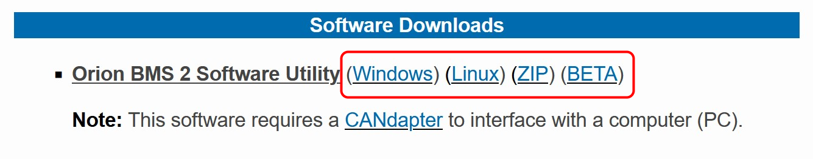
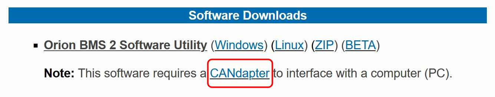
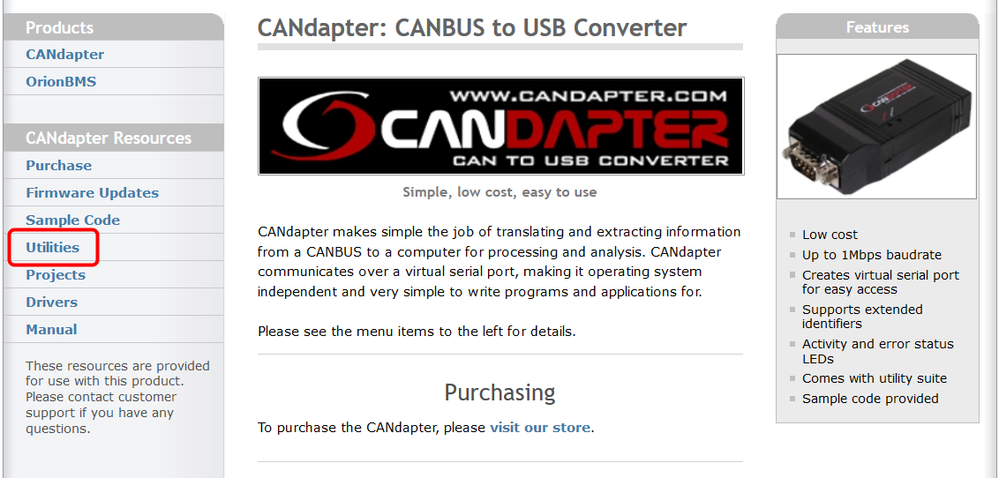

# Orion BMS

We use the Orion BMS 2. The Battery Management System is a device in our car which monitors the state of the accumulator (HV battery). It measures voltage, current, and SoC and uses this information to safely manage the discharge rate and battery health.

Follow this guide to set up the Orion BMS for debugging.

## Software Requirements

### Orion BMS 2 Utility

1. Go to the BMS product page <https://www.orionbms.com/products/orion-bms-standard/>.
2. Under __Software Downloads__, select the appropriate installer.

    

3. Run the installer. Use the default settings.

    ??? failure "Error: Windows Protected your PC"

        If you encounter this error, select __More Info__ then __Run Anyway__.

        

4. Run the Orion BMS Utility. Install the Java Runtime Environment if prompted.

### CANdapter

1. Go to the BMS product page <https://www.orionbms.com/products/orion-bms-standard/>.
2. Under __Software Downloads__, follow the CANdapter Link.

    

3. Click on the __Utilities__ menu.

    

4. Download the setup utility and install. Use the default settings.

## Communicating

1. "Connect to BMS"
2. "500 baudrate"
3. "Download config"
4. "Yes, continue"

_This article could use more detail_
