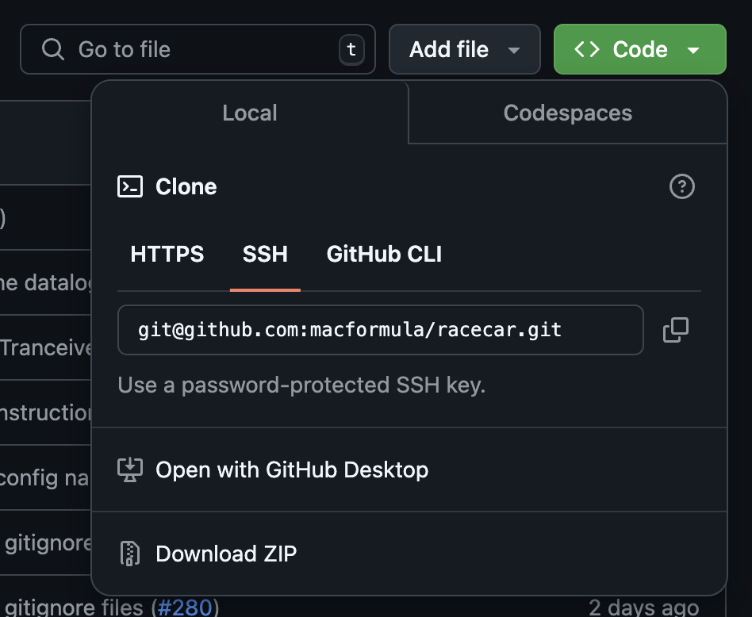

# :material-key: SSH and Commit Signing

This tutorial will guide you through setting up an SSH key and commit signing for GitHub. SSH keys are a more secure way to connect to GitHub, rather than other protocols like HTTPS. Commit signing is used to verify that commits are coming from you and have not been tampered with.

!!! warning
    You must have a [verified email address on GitHub](https://docs.github.com/en/account-and-profile/setting-up-and-managing-your-personal-account-on-github/managing-email-preferences/verifying-your-email-address) to add SSH keys and sign commits.

## Create an SSH Key

In a bash terminal, enter the following command:

=== "Windows"

    ```text
    ssh-keygen -t ed25519 -C "your_github_email@example.com"
    ```

    When prompted, save to the default location `c:/Users/YOU/.ssh/id_ed25519` and do not enter a passphrase. This will allow you to use the key without entering a password every time you push to GitHub.

    Continue with the following commands:

    ```text
    cat c:/Users/YOU/.ssh/id_ed25519 | clip
    eval "$(ssh-agent -s)"
    ssh-add c:/Users/YOU/.ssh/id_ed25519
    ```

=== "Linux/Mac"

    ```text
    ssh-keygen -t ed25519 -C "your_github_email@example.com"
    ```

    When prompted, save to the default location `~/.ssh/id_ed25519` and do not enter a passphrase. This will allow you to use the key without entering a password every time you push to GitHub.

    Continue with the following commands:

    ```text
    pbcopy < ~/.ssh/id_ed25519.pub
    eval "$(ssh-agent -s)"
    ssh-add ~/.ssh/id_ed25519
    ```

To add the key to your GitHub account, go to <https://github.com/settings/ssh/new>.

- Name your key something descriptive.
- Select "Authentication Key" as the key type.
- Paste the contents of `id_ed25519.pub` into the "Key" box.
- Click "Add SSH Key".

Open another terminal to test your connection to GitHub by entering the following command:

```text
ssh -T git@github.com
```

Type "yes" when it asks if you want to continue connecting.
You should see a message like "Hi username! You've successfully authenticated, but GitHub does not provide shell access."

## Enable Commit Signing

To add a signing key to your GitHub account, go to <https://github.com/settings/ssh/new>.

- Name your key something descriptive.
- Select "Signing Key" as the key type.
- Paste the contents of `id_ed25519.pub` into the "Key" box.
- Click "Add SSH Key".

Update your git configuration in your terminal to automatically sign commits with your key:

=== "Windows"
    ```text
    git config --global user.signingkey c:/Users/YOU/.ssh/id_ed25519
    git config --global gpg.format ssh
    git config --global commit.gpgsign true
    ```

=== "Linux/Mac"
    ```text
    git config --global user.signingkey ~/.ssh/id_ed25519
    git config --global gpg.format ssh
    git config --global commit.gpgsign true
    ```

## Enable Vigilant Mode

Go to <https://github.com/settings/ssh> and scroll down to the "Vigilant Mode" section. Enable "Enable Vigilant Mode".


This will now mark and display all of your commits with a signature verification status tag.


Verify your commits are signed by checking your commit history on GitHub for "Verified" tags.

## Set Repo to Use SSH

It is likely your repository is using HTTPS to connect to GitHub. To check which remote URL is currently being used, run the following terminal command inside of a repository:

```text
git remote -v
```

To convert to SSH, run the following command, replacing `orgname` and `reponame` with your GitHub organization and repository names (i.e. `macformula` and `racecar`):

```text
git remote set-url origin git@github.com:orgname/reponame.git
```

To avoid this manual configuration in the future, clone repositories using their SSH URL instead of HTTPS.



## Resources

- [Generating a new SSH key](https://docs.github.com/en/authentication/connecting-to-github-with-ssh/generating-a-new-ssh-key-and-adding-it-to-the-ssh-agent)

- [Testing your SSH connection](https://docs.github.com/en/authentication/connecting-to-github-with-ssh/testing-your-ssh-connection)

- [Managing commit signature verification](https://docs.github.com/en/authentication/managing-commit-signature-verification)
