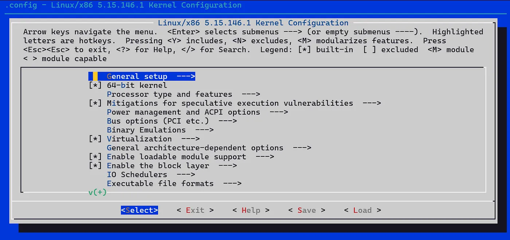
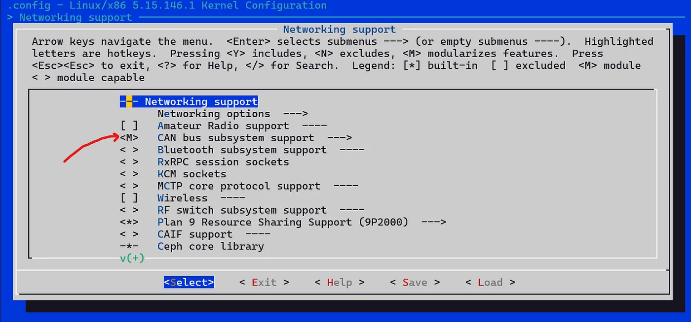
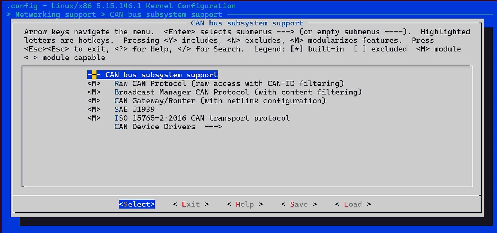
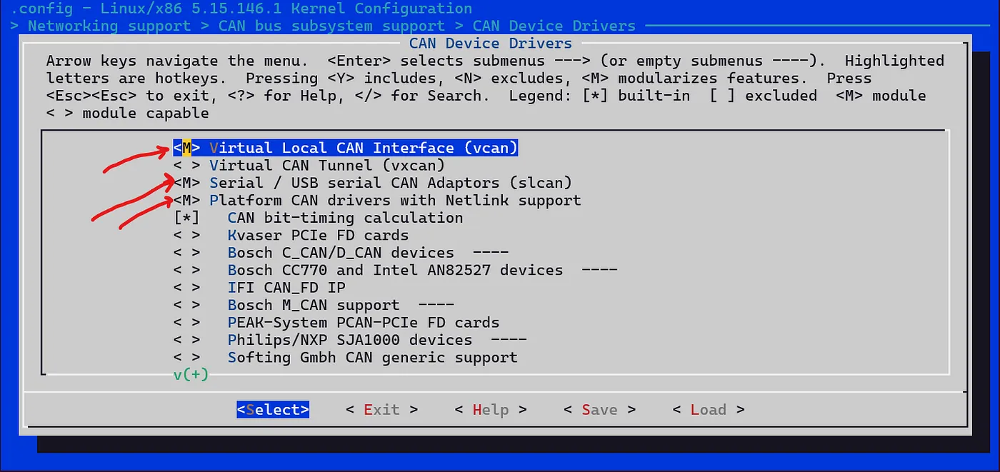

# :material-linux: Virtual CAN on WSL2

By default, WSL2 does not support Virtual CAN, however it can be enabled by building a custom WSL2 kernel.

!!! warning "This setup assumes you are running within WSL. If you do not have WSL installed, open Windows Powershell and run:"
        wsl --install

## Step 1: Update the WSL Environment

Run the following commands in your WSL terminal to update your environment and install the required dependencies.

    sudo apt-get update -y

### Install dependencies:

    sudo apt install -y dwarves libelf-dev flex bison libssl-dev libncurses-dev bc build-essential make
    sudo apt install -y --no-install-recommends wslu

## Step 2: Download the WSL2 Linux Kernel

To ensure compatibility, you need the specific kernel version of WSL2.

1. **Check your kernel version:**

        uname -r

    - Example output: `5.15.153.1-microsoft-standard-WSL2`

2. **Download the kernel source**:

    - Go to the [WSL2 Linux Kernel repository](https://github.com/microsoft/WSL2-Linux-Kernel/tags).
    - Find and copy the link for the `Source code (tar.gz)` file matching your kernel version.

3. **Download and extract the file**:

        wget https://github.com/microsoft/WSL2-Linux-Kernel/archive/refs/tags/linux-msft-wsl-5.15.153.1.tar.gz
        tar -xf linux-msft-wsl-5.15.153.1.tar.gz

4. **Navigate to the extracted folder:**

        cd WSL2-Linux-Kernel-<your-kernel-version>

## Step 3: Configure Kernel Settings

1. **Load current configuration**:

        cat /proc/config.gz | gunzip > .config

2. **Prepare the kernel for modules**:

        make prepare modules_prepare -j $(expr $(nproc) - 1)

3. **Open the configuration menu**:

        make menuconfig -j $(expr $(nproc) - 1)

    A menu interface should open. Use this to enable the necessary drivers for Virtual CAN.

### Enable CAN Drivers

- Navigate to **Networking Support** and press `Enter`.
- Select **CAN BUS subsystem support** by pressing `M`, then press `Enter`.

### Enable CAN Device Drivers

- Navigate to **CAN Device Drivers**.
- For each driver shown in the screenshot, press `M` to enable as a module.
- Save and exit the configuration menu.

## Step 4: Compile and Install Kernel Modules

Run the following commands to compile and install the Virtual CAN modules:

    make modules -j $(expr $(nproc) - 1)
    sudo make modules_install

Then, compile the kernel:

    make -j $(expr $(nproc) - 1)

## Step 5: Configure WSL to Use the Custom Kernel

1. **Create a symbolic link** for the module directory, matching your kernel version:

        sudo ln -s /lib/modules/5.15.153.1-microsoft-standard-WSL2+ /lib/modules/5.15.153.1-microsoft-standard-WSL2

2. **Copy the vmlinux file**:

    Replace `<yourwindowsloginname>` with your actual Windows username:

        cp vmlinux /mnt/c/Users/<yourwindowsloginname>/

    - In Windows File Explorer, you should now see a file named `vmlinux`.

3. **Configure `.wslconfig`**:

    Create a file named `.wslconfig` in the same directory (i.e. in `/mnt/c/Users/<yourwindowsloginname>/`) and paste the following to the file:

        [wsl2]
        kernel=C:\\Users\\<yourwindowsloginname>\\vmlinux

## Step 6: Restart WSL and Verify

1. In a separate Windows terminal (not WSL), restart WSL:

        wsl --shutdown

2. Wait ~10 seconds, then check that WSL has no active processes:

        wsl --list -v

3. **Verify the setup** by running WSL again, then execute these commands:

        sudo modprobe can
        sudo modprobe can-raw
        sudo modprobe vcan

If there is no other message, the installation was successful.